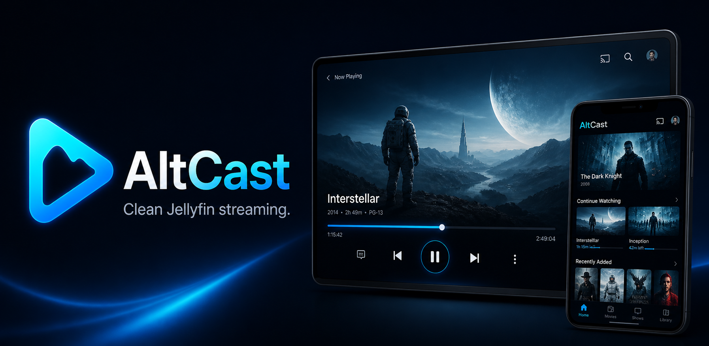

# AltCast

<p align="center">
  
</p>


### Description

AltCast is a modern Jellyfin client for movies and TV shows, built for a fast,
clean, and enjoyable browsing experience.

Sign in with your Jellyfin server and instantly explore your library with a
simple, polished interface inspired by the Alt brand.

Current highlights:

- Secure Jellyfin login
- Home screen with personalized sections
- Smooth navigation and responsive UI

AltCast is actively evolving, with upcoming improvements including richer
detail screens, expanded playback features, downloads, and remote casting.

## Dev

```bash
flutter pub get
flutter run
flutter analyze
flutter test
```

## Status

Scaffold + Login + Home. Detail screens, video player, downloads, and remote casting come next.
