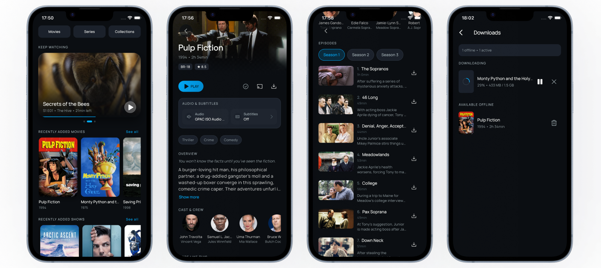

# AltCast

  

Bring your movies and TV shows back into a focused viewing app. AltCast connects to your Jellyfin server and turns it into a streaming experience for media **you own** — no subscriptions, no ads, no algorithms tracking what you watch.

> AltCast is an unofficial, third-party client. It is not affiliated with or endorsed by the Jellyfin project.

## Screenshots

  

## Install

  

### Other platforms

- **macOS** — download the unsigned `.app` from the [latest GitHub Release](https://github.com/filipefilardi/altcast/releases/latest), then drag it into `/Applications`. Because the build is unsigned and unnotarized, macOS Gatekeeper will block the first launch with a *"Apple cannot check it for malicious software"* warning. To open it:
    - **macOS 14 Sonoma and earlier:** right-click the app → *Open* → confirm in the dialog.
    - **macOS 15 Sequoia and newer:** double-click the app once (it will be blocked), then go to *System Settings → Privacy & Security*, scroll to the bottom, and click *Open Anyway*. Alternatively, run `xattr -dr com.apple.quarantine /Applications/AltCast.app` in Terminal.

  You only need to do this once. No re-signing or expiry.
- **iOS** — iOS support is already working, and I want to ship AltCast on the Apple App Store in the future. Right now, I do not have an active Apple Developer account. The yearly developer fee is currently too expensive for me, so App Store distribution is paused for now.

## What you need

- A [Jellyfin server](https://jellyfin.org/docs/general/installation/) with a movies or TV library.
- The server's URL and your Jellyfin credentials.

That's it. Your credentials stay in the device's secure storage, and the app only talks to your own server.

## Features

- Stream your full Jellyfin movies and TV library
- Browse movies, series, seasons, episodes, people, and collections with rich detail screens
- Home screen with recently added, continue watching, and personalized recommendations
- Full-text search across movies, series, episodes, and people
- Built-in video player with subtitle tracks, audio track selection, and brightness/volume gestures
- Playback progress reported back to Jellyfin so resume points stay in sync across clients
- Offline downloads with per-item management and cache control
- Remote control of other Jellyfin player sessions
- SyncPlay for synchronized watching across devices

## Get the most out of AltCast

AltCast works great on a plain Jellyfin install, but one server-side plugin unlocks a smoother viewing experience:

- **[Intro Skipper](https://github.com/intro-skipper/intro-skipper)** — community plugin that detects intros, outros, and recaps in your TV shows. AltCast picks up the segment timestamps automatically and shows a *Skip Intro* / *Skip Credits* chip during playback. Without it, episodes still play normally — you just skip manually.

Install it through your Jellyfin server's Dashboard → Plugins.

## Privacy

- Your Jellyfin credentials are stored in the device's secure keychain — never in plain text.
- Only the access token is sent to your own server. No data goes to AltCast, the developers, or any third party.
- No analytics. No telemetry. No ads.

## Contributing

Pull requests and issues are welcome — see [CONTRIBUTING.md](.github/CONTRIBUTING.md) to get a development environment running. All contributors are expected to follow the [Code of Conduct](.github/CODE_OF_CONDUCT.md).

## License

Licensed under the [Apache License, Version 2.0](LICENSE). See [NOTICE](NOTICE) for attribution.
